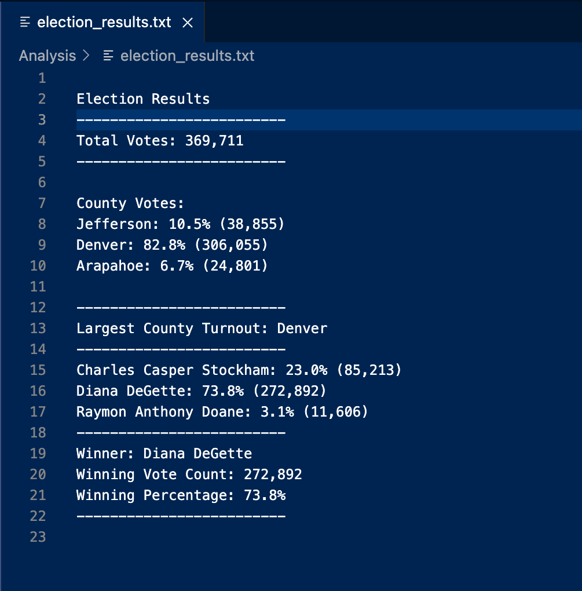

# Election_Analysis

# Python_Election_Analysis
Analysis of election results using python to read in a csv file and provide the following deliverables:
1. The Election Results Printed to the Command line
2. The Election Results Saved to a Text File
3. A written Analysis of the Election Audit (ReadMe.md)

## Overview of the Election Audit:

The election commission also asked for some additional data to complete the audit:
>* The voter turnout for each county
>* The percentage of votes from each county out of the total count
>* The county with the highest turnout

The results are expected to confirm that the output to the terminal matches the following template:

# Resources
* Data source : election_results.csv
* Software : Python 3.7.6, Visual Code 1.61.2
* Additional resources : https://www.python.org/

## Election_Audit Results:

### Specified "Asks":
>* How many votes were cast in this congressional election?
    - Total_Votes : 369,711
>* Provide a breakdown of the number of votes and the percentage of total votes for each county in the precinct.
    County Votes:
        - Jefferson: 10.5% (38,855)
        - Denver: 82.8% (306,055)
        - Arapahoe: 6.7% (24,801)
>* Which county had the largest number of votes?
    Denver: 82.8% (306,055)
>* Provide a breakdown of the number of votes and the percentage of the total votes each candidate received.
        - Charles Casper Stockham: 23.0% (85,213)
        - Diana DeGette: 73.8% (272,892)
        - Raymon Anthony Doane: 3.1% (11,606)
>* Which candidate won the election, what was their vote count, and what was their percentage of the total votes?
        Winner: Diana DeGette
        Winning Vote Count: 272,892
        Winning Percentage: 73.8%

## Results as recorded in my election_analysis.txt file:

## Election_Audit Python Code Summary:
The python code provided is "robust" and can be used for any state wide election given the follow:
1. First, a separate csv file is neeeded for each election
2. Second, need to create a separate election analysis txt file to record results
3. Third, the candidates or counties are not "Hard-wired" to the code therefore it can be used for any state wide elections
